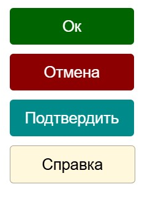
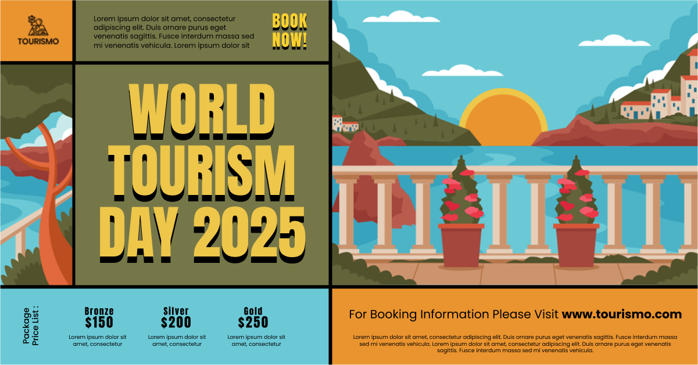
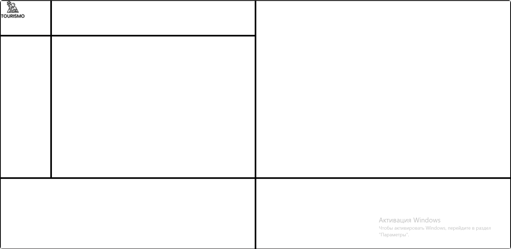
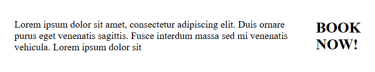
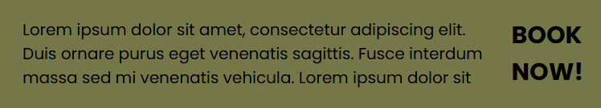
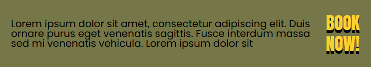
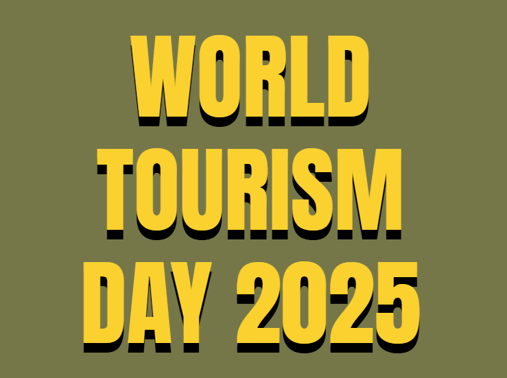
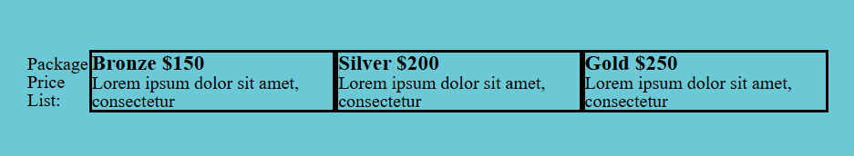
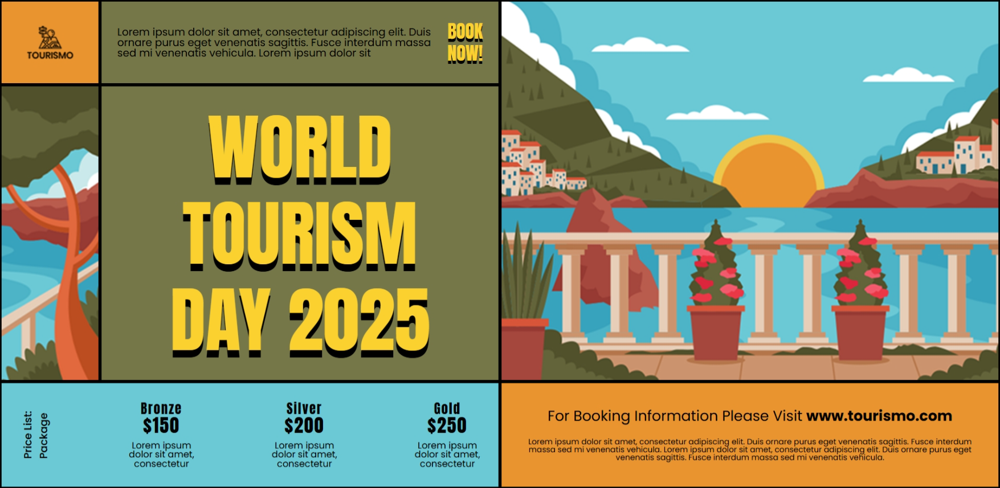

# Повторение HTML и CSS
---
## Подготовка к занятию
**Цель занятия** - К концу занятия ученики повторят основные теги HTML и свойства CSS, создадут веб-страницу с использованием изученных элементов и применят стилизацию через CSS.

**Задачи**
- Закрепить знания по структуре HTML-документа (`<!DOCTYPE>`, `<html>`, `<head>`, `<body>`).
- Повторить основные теги `HTML` для текста, списков, изображений и ссылок.
- Освежить в памяти базовые `CSS`-свойства и способы их подключения (через `<style>` или отдельный файл).
- Научиться комбинировать `HTML` и `CSS` для создания простого, но стилизованного макета.

**Планируемые результаты занятия**

*Ученики смогут:*
- Верно использовать HTML-теги для структурирования контента.
- Применять CSS для изменения цвета, шрифтов, отступов и фона элементов.
- Создавать веб-страницу с:
    - Заголовком (`<h1>`),
    - Абзацем текста (`<p>`),
    - Списком (`<ul>` или `<ol>`),
    - Изображением (``),
    - Ссылкой (`<a>`),
- Стилями для всех элементов.
- Проверить работу через открытие файла в браузере.


## **Структура занятия**  

---

### **1. Вводная часть (10 мин)**  
- **Приветствие, обсуждение целей:**  
  - *«Сегодня углубимся в HTML/CSS, повторим ключевые моменты и создадим мини-проект — лендинг»*.  
- **Мотивация:** Показ крутых примеров (например, анимированная кнопка или адаптивная галерея).  
 

---

### **2. Повторение теории (20 мин)**  
**Формат:** Лекция + интерактивные задания.  

#### **HTML (10 мин)**  
- **Структура документа:**  
  - Разбор `<!DOCTYPE>`, `<html>`, `<head>`, `<body>`.  
  - Важность семантики: `<header>`, `<main>`, `<footer>`, `<section>`.  
- **Основные теги:**  
  - Текст: `<h1>`–`<h6>`, `<p>`, `<span>`.  
  - Списки: `<ul>`, `<ol>`, `<li>`.  
  - Медиа: ``, `<video>`, `<audio>`.  
  - Ссылки: `<a>` (атрибуты `href`, `target`).  
- **Практика:**  
  - *«Собери структуру сайта за 5 минут»* — дети расставляют теги на интерактивной доске (Miro или Figma).  

#### **CSS (10 мин)**  
- **Способы подключения:**  
  - Встроенные стили, `<style>`, внешний файл.  
- **Свойства:**  
  - Текст: `font-family`, `color`, `text-align`.  
  - Блоки: `margin`, `padding`, `border`, `background`.  
  - Позиционирование: `display` (`block`, `inline`, `inline-block`).  
- **Интерактив:**  
  - *«Найди ошибку»* — учитель показывает код с багами, ученики исправляют (например, неработающий `background-image`).  

---

### **3. Практика: создание лендинга (140 мин)**  
**Проект:** Лендинг для игры, фильма или блога (на выбор по макету).  

#### **Этап 1: HTML-верстка (30 мин)**  
- **Требования:**  
  - Шапка с названием (`<header>`).  
  - 2–3 секции (`<section>`): описание, галерея, контакты.  
  - Футер с копирайтом (`<footer>`).  
- **Помощь:**  
  - Готовый шаблон для новичков (если нужно).  

#### **Этап 2: CSS-оформление (40 мин)**  
- **Базовые стили:**  
  - Цвета, шрифты, отступы.  
- **Доп. элементы:**  
  - Стилизация кнопки (`:hover`).  
  - Границы для изображений (`border-radius`).  
- **Для продвинутых:**  
  - Простая анимация (`@keyframes`).  


#### **Этап 3: Flexbox/Grid (60 мин)**  
- **Объяснение:**  
  - Flexbox: `display: flex`, `justify-content`, `align-items`.  
  - Grid: `grid-template-columns`, `gap`.  
- **Практика:**  
  - Переделать одну секцию лендинга на Flexbox/Grid.  

---

### **4. Рефлексия и домашнее задание (10 мин)**  
- **Вопросы:**  
  - *«Что было сложным?»*  
  - *«Какое свойство CSS понравилось больше всего?»*  
- **Д/З:**  
  - Добавить адаптивность (медиа-запросы) или сверстать ещё одну страницу.  


## Часть №1 Вводная часть

**Преподаватель**: *«Сегодня мы повторим ключевые теги и свойства, а потом создадим настоящий лендинг. Это основа для любых будущих проектов — от блогов до интернет-магазинов!»*


**Преподаватель**: *«Помните, как мы стилизовали кнопки? Как можно было создавать кнопки? Сейчас на экране вы видите кнопки. Скажите, какие здесь применены свойства?*


**Разминка** - создать 4 кнопки и стилизовать их так, как показано на экране



>.html
```html
    <button class="btn-ok">Ок</button>
    <button class="btn-cancel">Отмена</button>
    <button class="btn-primary">Подтвердить</button>
    <button class="btn-info">Справка</button>
```

>.css
```css
button{
    width: 135px;
    height: 40px;
    font-size: 17px;
    text-align: center;
    margin: 10px;
    border-radius: 4px;
    font-family: arial;
    border: none;
}

.btn-ok{
    background-color: darkgreen;
    color: white;
}
.btn-cancel{
    background-color: darkred;
    color: white;
}
.btn-primary{
    background-color: darkcyan;
    color: white;
}
.btn-info{
    background-color: cornsilk;
    color: black;
    border: .5px solid rgba(0, 0, 0, 0.329);
}
```


## Часть №2 Повторение теории

#### **1. Структура HTML-документа (7 минут)**  
**Формат:** Интерактивный разбор + визуализация.  

**Шаг 1. Базовые теги (3 минуты)**  
- Преподаватель показывает код на экране/доске:  
  ```html
  <!DOCTYPE html>
  <html>
    <head>
      <title>Мой сайт</title>
    </head>
    <body>
      <!-- Контент здесь -->
    </body>
  </html>
  ```  
- **Вопросы ученикам:**  
  - *«Зачем нужен `<!DOCTYPE>`?»* → Объяснение: говорит браузеру, что это `HTML5`.  
  - *«Что должно быть в `<head>`?»* → `<title>`, `<meta>`, ссылки на CSS.  
  - *«Где размещается видимый контент?»* → `<body>`.  

**Шаг 2. Семантические теги (4 минуты)**  
- Показ схемы сайта с тегами:  
  ```html
  <header>Шапка</header>
  <main>
    <section>О нас</section>
    <section>Галерея</section>
  </main>
  <footer>Подвал</footer>
  ```  
- **Практическое задание:**  
  - *«Расположите теги в правильном порядке»* → Ученики расставляют `<header>`, `<main>`, `<footer>` на интерактивной доске (Miro/FigJam).  

---

#### **2. Основные HTML-теги (6 минут)**  
**Формат:** Мини-квиз + демонстрация.  

**Шаг 1. Текст и списки (3 минуты)**  
- Преподаватель пишет на доске:  
  - *«Как создать заголовок второго уровня?»* → Ученики называют `<h2>`.  
  - *«Как сделать нумерованный список?»* → Разбор `<ol>` и `<li>`.  
- **Ошибка для исправления:**  
  ```html
  <p>Это абзац</p>
  <ul>Пункт 1</ul> <!-- Где <li>? -->
  ```  

**Шаг 2. Медиа и ссылки (3 минуты)**  
- Разбор атрибутов:  
  - `` → *«Что будет, если `src` указан неверно?»* (ALT-текст).  
  - `<a href="https://youtube.com" target="_blank">Ютуб</a>` → *«Как открыть ссылку в новой вкладке?»*.  

---

#### **3. Основы CSS (7 минут)**  
**Формат:** Объяснение + игра «Найди ошибку».  

**Шаг 1. Способы подключения (2 минуты)**  
- Показ 3 вариантов:  
  1. Встроенные стили: `<p style="color: red;">`.  
  2. Внутри `<style>` в `<head>`.  
  3. Внешний файл: `<link rel="stylesheet" href="style.css">`.  
- **Вопрос:** *«Какой способ лучше и почему?»* → Обсуждение (внешний файл для удобства).  

**Шаг 2. Ключевые свойства (3 минуты)**  
- Разбор на примере кнопки:  
  ```css
  button {
    color: white;
    background: blue;
    padding: 10px;
    border-radius: 5px;
  }
  ```  
- **Фокус на `display`:**  
  - Блок (`block`), строка (`inline`), блочно-строчный (`inline-block`).  

**Шаг 3. Игра «Найди ошибку» (2 минуты)**  
- Учитель показывает код с ошибкой:  
  ```css
  .header {
    font-size: 20px; /* ОК */
    margin: 10px 5px; /* ОК */
    background-color: #gggggg; /* Неверный HEX! */
  }
  ```  
- Ученики ищут проблему и объясняют.  

---

### **Проверка понимания (дополнительно, если время осталось)**  
- **Быстрый опрос:**  
  - *«Какой тег создает ненумерованный список?»* → `<ul>`.  
  - *«Как изменить цвет текста в CSS?»* → `color`.  

### **Переход к практике:**  
*«Теперь применим эти знания в реальном проекте — начнем верстать лендинг!»*.  

---


## Часть 3. Практика. Создание лендинга




*На сегодняшнем занятии мы с вами поработаем вот с таким вот сайтом. Сначала мы проработаем каждый отдельный элемент, а затем попробуем объединить все это в один элемент. В этот момент мы вспомним*
- *Как подключать шрифты*
- *Как настраивать тени*
- *Как настраивать задний фон и поворачивать текст*
- *Как масштабировать картинки*
- *Семантику страницы*

*Начнем с создания макета для страницы*



*Для этого, создадим несколько блоков внутри тега main*
>.html
```html
    <main>
        <div class="logo" style="grid-area: logo;">
        </div>
        <div class="book" style="grid-area: book;">
        </div>
        <div class="big-image" style="grid-area: big-image;">
        </div>
        <div class="small-image" style="grid-area: small-image;">
        </div>
        <div class="hero" style="grid-area: hero;">
        </div>
        <div class="footer-one" style="grid-area: footer-one;">
        </div>
        <div class="footer-two" style="grid-area: footer-two;">
        </div>
    </main>
```

*Это наша сетка, в которой будут располагаться элементы, здесь мы продублировали имена классов к свойству `grid-area`, так как мы будем использовать `grid`-верстку для этого задания*

*Давайте напишем `css`-код для того, чтобы сетка встала на свои места, а потом будем каждый объект по отдельности стилизовать*
>.css
```css
main{
    display: grid;
    grid-template-columns: 1fr 4fr 5fr;
    grid-template-rows: 1fr 4fr 2fr;
    grid-template-areas: 
    "logo book big-image"
    "small-image hero big-image"
    "footer-one footer-one footer-two"
    ;
    height: 100vh;
}
main div{
    border: 3px solid black;
}
```

*С помощью свойств `grid`, мы настроили сетку `3х3` и расставили компоненты по своим местам, для этого нам пригодилось свойство `grid-area`, которое было записано для каждого блока `div`*


*Теперь можно стилизовать каждый блок по отдельности и начнем мы с логотипа*
>.html
```html
        <div class="logo" style="grid-area: logo;">
            
        </div>
```
*Для этого блока нужно задать задний фон и расположить сам логотип по центру, для этого воспользуемся свойствами `background` для фона и семейство `flex` для центрования элемента внутри контейнера*

>.css
```css
.logo{
    background: #EA942F;
    display: flex;
    align-items: center;
    justify-content: center;
}
```

*Переходим к следующему элементу - `book`*
*Он имеет в себе два текстовых элемента - `<p>` и `<h2>`*
>.html
```html
        <div class="book" style="grid-area: book;">
            <p>Lorem ipsum dolor sit amet, consectetur adipiscing elit. Duis ornare purus eget venenatis sagittis. Fusce interdum massa sed mi venenatis vehicula. Lorem ipsum dolor sit</p>
            <h2>BOOK <br> NOW!</h2>
        </div>
```
*Нужно сделать так, что бы они были на одной строке и центровались, для этого воспользуемся `flex`*
>.css
```css
.book{
    display: flex;
    align-items: center;
    justify-content: space-between;
    gap: 25px;
    padding: 24px;
}
```
*Дополнительно были настроены внутренние отступы блока `padding`, а так же настроено расстояние между элементами `gap`, равное в `25px`*



*Нам понадобятся шрифты `Anton` и `Poppins`, которые можно взять с сайта `google-font`*
[Ссылка на сайт](https://fonts.google.com/)
>.css
```css
@import url('https://fonts.googleapis.com/css2?family=Anton&family=Poppins:ital,wght@0,100;0,200;0,300;0,400;0,500;0,600;0,700;0,800;0,900;1,100;1,200;1,300;1,400;1,500;1,600;1,700;1,800;1,900&display=swap');
```

*Подключаем шрифт и задний фон к этому блоку*
>.css
```css
.book{
    ...
    background: #767749;
    font-family: "Poppins";
}
```


*Теперь настроим заголовок `<h2>`. У него есть свои настройки для размера шрифта, типа жирности, цвета и тени*
>.css
```css
.book h2{
    color: #FAD12F;
    font: 400 28px "Anton";
    line-height: 1.2;
    text-align: center;
    text-shadow: 0px 5px 0px black;
}
```



*Подгрузим изображения, оба будут реализованы через `background` и добавим им подстраивание под размеры блока с помощью `background-size`* 
>.css
```css
.big-image{
    background: url(../images/big-image.png);
    background-size: cover;
}

.small-image{
    background: url(../images/small-image.png);
    background-size: cover;
}
```

*Переходим к `hero`-блоку. В нем есть всего один заголовок первого уровня `<h1>` и точно такая же настройка, как у заголовка второго уровня `<h2>` с изменениями только по размеру шрифта*
>.html
```html
    <div class="hero" style="grid-area: hero;">
        <h1>world <br> tourism day <br> 2025</h1>
    </div>
```
>.css
```css
h1 {
    color: #FAD12F;
    font: 400 100px "Anton";
    line-height: 1.2;
    text-align: center;
    text-shadow: 0px 11px 0px black;
    text-transform: uppercase;
}
```

*Помимо этого, текст должен стоять по центру блока*
>.css
```css
.hero{
    display: flex;
    align-items: center;
    justify-content: center;
    background: #767749;
}
```



*Переходим к разработке `footer`*
>.html
```html
        <div class="footer-one" style="grid-area: footer-one;">
            <p class="package-list">
                Package <br>
                Price List:
            </p>
            <div class="package-type">
                <h3>Bronze
                    <span>$150</span>
                </h3>
                <p>Lorem ipsum dolor sit amet, consectetur</p>
            </div>
            <div class="package-type">
                <h3>Silver
                    <span>$200</span>
                </h3>
                <p>Lorem ipsum dolor sit amet, consectetur</p>
            </div>
            <div class="package-type">
                <h3>Gold
                    <span>$250</span>
                </h3>
                <p>Lorem ipsum dolor sit amet, consectetur</p>
            </div>
        </div>
```
*Настроим сам контейнер, а потом каждый элемент по отдельности*
>.css
```css
.footer-one{
    display: flex;
    padding: 28px;
    justify-content: space-between;
    align-items: center;
}
```



*Теперь настроим каждый элемент по отдельности, начнем с `package-list`*
>.css
```css
.package-list{
    font: 500 16px "Poppins";
    writing-mode: vertical-lr;
    transform: rotate(180deg);
}
```

*Добавим настройку к `package-type`*
>.html
```html
.package-type{
    border: none;
    width: 100px;
    text-align: center;
    font: 400 14px "Poppins";
}
```

*Теперь настроим заголовок*
>.css
```css
.package-type h3{
    font: 400 20px "Anton";
    line-height: 1.1;
    letter-spacing: 1.6px;
    margin-bottom: 10px;
}
```
*Само число больше, поэтому мы до этого обернули его в тег `span`, где мы увеличим шрифт на несколько пикселей*

>.css
```css
.package-type h3 span{
    font-size: 28px;
}
```


*Осталось сделать последний блок, в котором находится только абзац `<p>` и заголовок `<h4>`*

>.html
```html
        <div class="footer-two" style="grid-area: footer-two;">
            <h4>For Booking Information Please Visit <b>www.tourismo.com</b></h4>
            <p>Lorem ipsum dolor sit amet, consectetur adipiscing elit. Duis ornare purus eget venenatis sagittis. Fusce
                interdum massa sed mi venenatis vehicula. Lorem ipsum dolor sit amet, consectetur adipiscing elit. Duis
                ornare purus eget venenatis sagittis. Fusce interdum massa sed mi venenatis vehicula.</p>
        </div>
```

*Контейнер настраивается через `flex-direction` и центрирование по блоку с помощью `flex`

>.css
```css
.footer-two{
    display: flex;
    flex-direction: column;
    align-items: center;
    justify-content: center;
    text-align: center;
    gap: 22px;
    background: #EA942F;
    font-family: "Poppins";
    font-size: 12px;
    padding: 24px;
}

.footer-two h4{
    font-size: 22px;
    font-weight: 400;
}
```


## Часть 4. Подведение итогов
### **Этап: Подведение итогов и рефлексия (15 минут)**  

- **Метод «3 слова»:**  
  - Ученики описывают урок тремя словами (например: *«Креатив, Flexbox, Вдохновение»*).  

- **Анонимный опрос (если время позволяет):**  
  - На листочках или в Google-форме:  
    1. *Что было самым полезным?*  
    2. *Какая тема осталась непонятной?*  
    3. *Предложения по следующим урокам*.  

---

#### **Домашнее задание**  
- **Базовое задание:**  
  - Добавить медиа-запросы для мобильной версии (адаптивность).  
- **Дополнительно:**  
  - Рекомендация ресурсов:  
    - [Flexbox Froggy](https://flexboxfroggy.com/) для тренировки.  
    - [CSS-Tricks](https://css-tricks.com/) для углубленного изучения.  

---

#### **4. Заключительные слова**  
- **Мотивация:**  
  - *«Сегодня вы сделали первый шаг к созданию профессиональных сайтов!»*  
- **Благодарность:**  
  - *«Спасибо за активность — увидимся на следующем уроке!»*  

---
